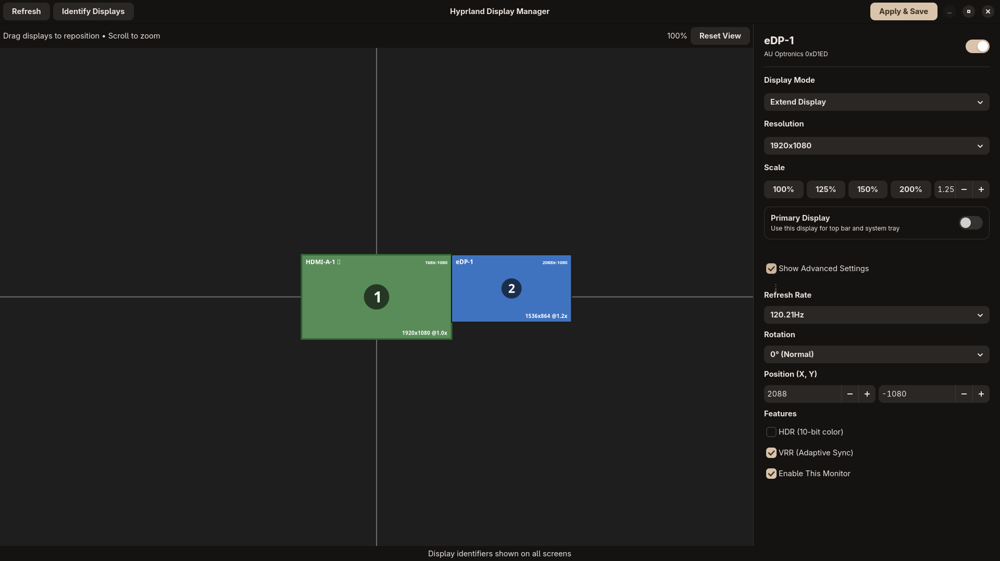
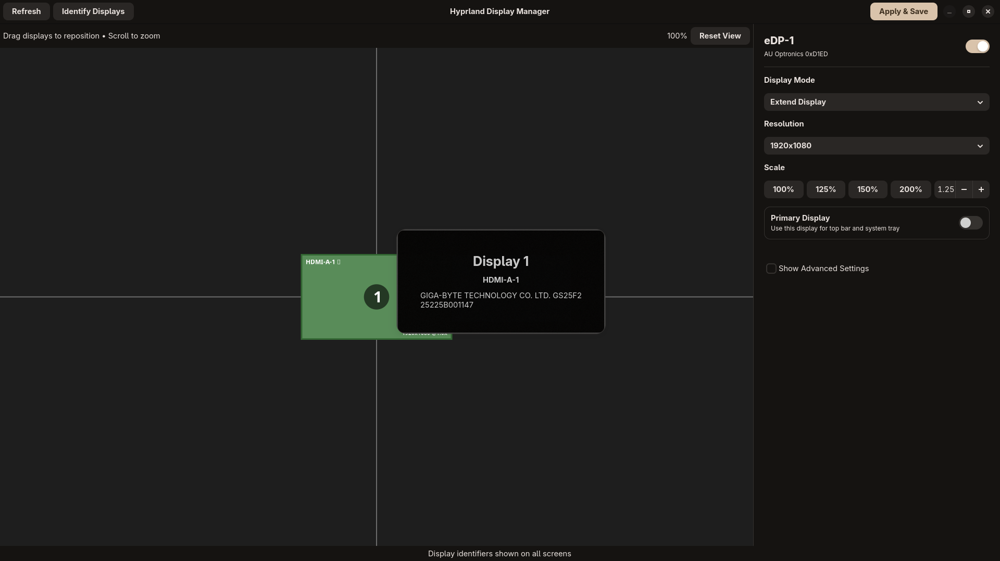

# HyprDisplays

A GUI tool for Hyprland to manage your display configuration.


- **Drag-and-drop** monitor layout interface.
- **Auto-apply** saved profiles when monitors effectively change (requires daemon).
- **Safety check**: Reverts changes after 15 seconds if not confirmed.

## Screenshots

<p align="center">
  
  
</p>

## Installation

### Fedora

```bash
sudo dnf install python3-gobject gtk4 libadwaita
./installer.py
```

### Other Distributions

Install `gtk4`, `libadwaita`, and `python3-gobject`, then run:

```bash
./installer.py
```

## Usage

Launch from your application menu ("Hyprland Display Manager") or terminal:

```bash
hyprdisplays
```

## Documentation

- [Getting Started](docs/README.md)
- [Configuration Files](docs/CONFIGURATION.md)
- [Daemon & Advanced Usage](docs/ADVANCED.md)
